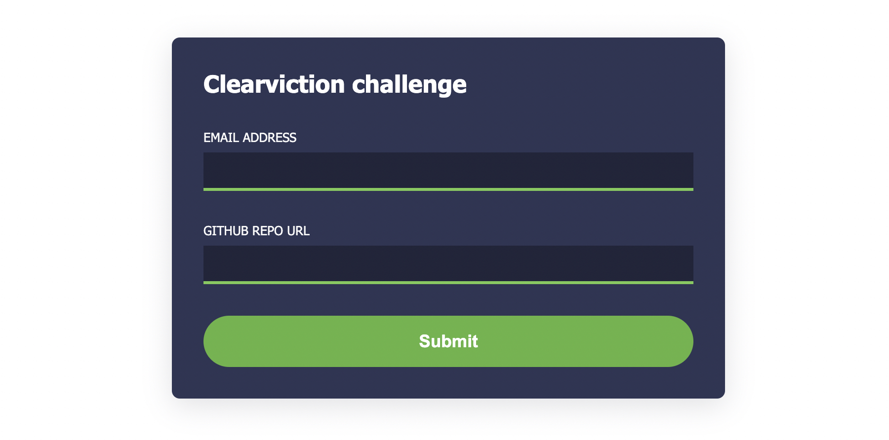
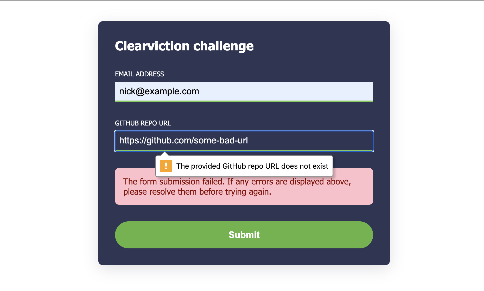

# Clearviction Code Challenge

This is my submission for the Clearviction code change. It meets the following requirements:

- Inludes HTML, CSS, and JavaScript files
- Submits an email address and GitHub URL to the provided Clearviction URL using a `fetch` request

## Running the application

The source code for the application is located in the `src` directory. It can be viewed by running a static file server in that directory. If you have `node` on your machine, you can use the `serve` package as a simple file server:

```
cd src
npx serve .
```

The application will then be viewable on http://localhost:3000.

## Assumed requirements

The solution in this repository assumes some additional (unstatement) requirements. Namely:

- The form should validate user input and provide associated error messages
- The form and associated error messages should be accessible
- The form should be responsive

Additionally, it's assumed that a "nice to have" is to validate that the provided GitHub repository URL actually exists.

## Approach

The approach in this solution uses a standard HTTP form with some CSS styles:



Since the requirement is to execute a `fetch` request, JavaScript is used to add an event handler to the `form.submit` event. This handler does the following:

- Prevents the default submit action
- Performs validations
- Executes the fetch request
- Reports status and errors to the user

### Validation

HTML5 validation is pretty good: it's informative, well-placed, and accessible.

The solution in this submission uses default HTML5 validation for the `email` field and a custom GitHub repo validator for the `githubRepoUrl`. This custom validator performs a request to the GitHub API to verify the repository exists.

The following screenshot shows a native HTML5 error message using the custom GitHub repo URL validator:



In addition to these validation errors, there is a generic error box (shown in the screenshot). This generic error is helpful for unanticipated errors (e.g., server errors or connectivity issues). This generic error box is an `aria-live="polite"` area and will be announced to screen-readers.

## Downsides of this approach

This approach may be a bit heavy on the JavaScript for a "simple" form. Forgoing the GitHub API-based validation would reduce the amount of JavaScript; however, I thought it was a cool feature.

## Potential improvements

- **Improved reactivity.** There is a good bit of "state-view syncing" going on in this solution. When I find myself doing a lot of state-view syncing, I think it's possible a good use case for a reactive library that helps bind data and associated views. Should this form get bigger (or grow into a full app), I would strongly consider a popular reactive framework (e.g., React, Vue, Svelte, etc.).
- **Better error messages.** Ideally, a form like this would be developed with better knowledge of API responses, which could potentially lead to better user-facing error messages.
- **Automated testing.** Adding some automated tests for this app can help make sure it performs correctly under both "happy path" and suboptimal use cases.
